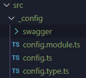
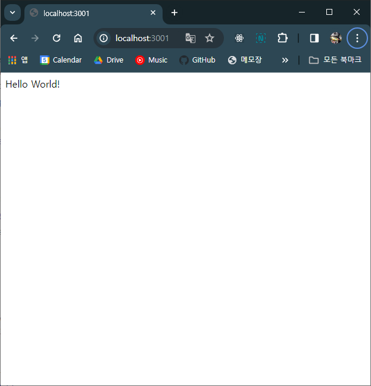
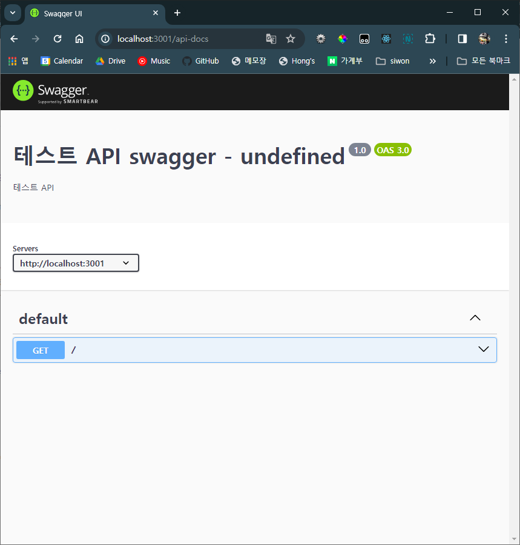

# nestjs

## Stting
- node : v20.11.0
- npm : 10.2.4
- https://docs.nestjs.com/cli/usages

## 과제내용
### 필수
- sample local API 생성
- http://localhost:3001/
- API 제작
    - 회원 API
        - 가입
        - 로그인
    - 게시판 API
        - 글 쓰기
        - 글 수정
        - 글 리스트 
        - 글 삭제
- DB 
    - 10.9.1.99 개발 디비 사용
    - 개별로 local에 mysql 셋팅하여 사용 가능

### 추가
- 로컬 vm서버에 올리고 nginx 또는 apache 로 proxy pass 설정하여 도메인으로 넘기기
- http://study.siwonschool.com 접속시 해당 api 로 접근
- 컨테이너에 해당 API 올리기


## Example 목차
1. [nestjs cli 도구 설치](1.-nestjs-cli-도구-설치)
2. [프로젝트 생성](2.-프로젝트-생성)
3. [.env 설정](3.-.env-설정)
4. [configure 설정](4.-configure-설정)
5. [서비스 시작](5.-서비스-시작)
6. [swagger 설정](6.-swagger-설정)
7. [DB 연결 ( typeOrm )](7.-DB-연결-(-typeOrm-))
8. [로그인-api-만들기](8.-로그인-api-만들기)

## Example
1. nestjs cli 도구 설치
    ```bash
    $ npm install -g @nestjs/cli
    ```
2. 프로젝트 생성
    ```bash
    // nest project 생성
    // nest new {project_name}
    $ nest new api
    ⚡  We will scaffold your app in a few seconds..

    ? Which package manager would you ❤️  to use? npm
    ```
3. .env 설정
    ```bash
    $ cd api 
    $ echo NODE_ENV=local > .env
    ```
    - .env 파일 수정 ( .env.example 파일 참고 )
    ```bash
    ## Server Env ( local, development, production )
    NODE_ENV=local
    CRON_FLAG=false

    DEBUG_DB=true
    TZ=Asia/Seoul

    APP_NAME=sample

    HTTP_PORT=3001

    DB_MAIN_HOST=
    DB_MAIN_PORT=3306
    DB_MAIN_USER=
    DB_MAIN_PASSWORD=
    DB_MAIN_SCHEMA=

    DB_REDIS_HOST=192.168.30.201
    DB_REDIS_PORT=6379
    ```

4. configure 설정
    - https://docs.nestjs.com/techniques/configuration
    - 환경별 .env 관리와 라이브러리들의 config 통합을 위한 관리
    - src 폴더 하위에 _config 폴더 생성
    <br />
    
    <br />
    - @nestjs/config 패키지 설치
    ```bash
    $ npm i @nestjs/config
    ```
    - config.module.ts : config 모듈 선언 파일
    ```typescript
    // src/_config/config.module.ts
    import { Module } from '@nestjs/common';

    @Module({
    imports: []
    })

    export class ConfigModule {}
    ```
    - confg.ts : config 설정 파일
    ```typescript
    // src/_config/config.ts
    import { SwaggerConfig } from './swagger/config';

    export default () => ({
        port : parseInt(process.env.HTTP_PORT) || 3001,
        swagger: SwaggerConfig()
    });
    ```
    - config.type.ts : config type 설정 파일
    ```typescript
    // src/_config/config.type.ts
    import {
        OpenAPIObject,
        SwaggerCustomOptions,
        SwaggerDocumentOptions
    } from '@nestjs/swagger/dist/interfaces';
    
    export type TSwaggerConfig = {
        config: Omit<OpenAPIObject, 'paths'>;
        options: SwaggerDocumentOptions;
        customOptions: SwaggerCustomOptions;
    };    
    ```
    - app.module.ts 에 전역 설정
    ```typescript
    // src/app.module.ts
    import { Module } from '@nestjs/common';
    import { ConfigModule as NestConfigModule } from '@nestjs/config';
    import configuration from './_config/config';
    import { ConfigModule } from './_config/config.module';

    import { AppController } from './app.controller';
    import { AppService } from './app.service';

    @Module({
        imports: [
            NestConfigModule.forRoot({
                //cache: true, // config 캐시 여부
                isGlobal: true, // 전역 사용을 위한 설정
                load : [configuration]
            }),
            ConfigModule
        ],
        controllers: [AppController],
        providers: [AppService],
    })
    export class AppModule {}
    ```
5. 서비스 시작
    ```bash
    # package.json , script 참고

    # debug 모드로 실행
    $ npm run start:debug
    or
    # watch 모드로 실행
    $ npm run start:watch
    ```
    ``` bash 
    $ npm run start


                            Thanks for installing Nest 🙏
                    Please consider donating to our open collective
                            to help us maintain this package.


                🍷  Donate: https://opencollective.com/nest
    [오전 10:08:24] Starting compilation in watch mode...

    [오전 10:08:37] Found 0 errors. Watching for file changes.

    Debugger listening on ws://127.0.0.1:9229/69b256b8-5d50-4216-876f-eebecca153dc
    For help, see: https://nodejs.org/en/docs/inspector
    [Nest] 40808  - 2024. 02. 13. 오전 10:08:42     LOG [NestFactory] Starting Nest application...
    [Nest] 40808  - 2024. 02. 13. 오전 10:08:42     LOG [InstanceLoader] AppModule dependencies initialized +22ms
    [Nest] 40808  - 2024. 02. 13. 오전 10:08:43     LOG [RoutesResolver] AppController {/}: +140ms
    [Nest] 40808  - 2024. 02. 13. 오전 10:08:43     LOG [RouterExplorer] Mapped {/, GET} route +22ms
    [Nest] 40808  - 2024. 02. 13. 오전 10:08:43     LOG [NestApplication] Nest application successfully started +21ms
    ```
    - http://localhost:3000/ 접속하여 확인
    <br />
    
    <br />

6. swagger 설정
    - https://docs.nestjs.com/openapi/introduction
    - @nestjs/swagger 설치
    ```bash
    $ npm i @nestjs/swagger
    ```
    - swagger config 설정 파일 추가    
    ```typescript
    // src/_config/swagger/config.ts
    import { DocumentBuilder } from '@nestjs/swagger';
    import { TSwaggerConfig } from './../config.type';

    /**
    * Swagger Config
    *
    */
    export function SwaggerConfig() {
        return <TSwaggerConfig>{
            config: new DocumentBuilder()
            .setTitle(`테스트 API swagger - ${process.env.NODE_ENV}`)
            .setDescription('테스트 API')
            .setVersion('1.0')
            .addServer('http://localhost:3001')
            .build(),
            options: {
            //extraModels: [Dto]
            },
            customOptions: {
                swaggerOptions: {
                    persistAuthorization: true, // 새로고침해도 token 값 유지
                    docExpansion: 'list', // Swagger 문서 펼침여부 String=["list"*, "full", "none"]
                    tagsSorter: 'alpha', // 정렬 순서
                }
            }
        }
    }
    ```
    - main.ts에 swagger setup 
    ```typescript
    // src/main.ts
    import { NestFactory } from '@nestjs/core';
    import { ConfigService } from '@nestjs/config';
    import { TSwaggerConfig } from './_config/config.type';
    import { SwaggerModule } from '@nestjs/swagger'; // Swagger module 추가

    import { AppModule } from './app.module';

    async function bootstrap() {
        const app = await NestFactory.create(AppModule);

        const configService = app.get(ConfigService); // Env config get
        const PORT: number = configService.get<number>('port');

        const swaggerConfig = configService.get<TSwaggerConfig>('swagger'); //swagger config 가져오기
        const document = SwaggerModule.createDocument( // swagger 문서 관련 설정
            app,
            swaggerConfig.config,
            swaggerConfig.options
        );
        SwaggerModule.setup('api-docs', app, document, swaggerConfig.customOptions); // swagger 경로 와 설정값 추가하여 설정

        await app.listen(PORT);
    }
    bootstrap();
    ```
    - swagger 문서 접근 ( http://localhost:3001/api-docs )
    <br />
    
    <br />
7. DB 연결 ( typeOrm )
    - https://docs.nestjs.com/techniques/database
    - @nestjs/typeorm , mysql 설치
    ```bash
    $ npm i --save @nestjs/typeorm
    $ npm i --save mysql2
    ```
    - entity생성
        - Database schema 및 table 구성
        - 폴더 구성 : src/_entities/{database명}/{table명}.entity.ts
    ```javascript
    // src/_entities/study/member.entity.ts
    import { Entity, Column, PrimaryColumn } from "typeorm";

    @Entity({
        name: "member", // 테이블 명
        database: "study", // database 명
        schema : "study" // database schema 명
    })
    export class Member{ 
        @PrimaryColumn() // 필드 컬럼 속성
        UserNo : number; // 필드명 : 필드 타입

        @Column()
        Id : string;
        
        @Column()
        Passwd : string;

        @Column()
        Name : string;

        @Column()
        RegiDatetime : string; // 날짜의 경우 Date타입에서 버그 발생으로 string 처리

        @Column()
        LoginDatetime : string;
        
    }
    ```
    ```typescript
    // src/_entities/entities.ts
    // entities 를 database config 에 인입시키기 위해 하나의 파일로 생성
    import { entities as study } from './study/_entities';

    export const entities = [
        ...study, 
    ]
    ```
    - config 설정
    ```typescript
    // src/_config/database/config.service.ts
    import { Injectable } from '@nestjs/common';
    import { ConfigService } from '@nestjs/config';
    import { TypeOrmModuleOptions, TypeOrmOptionsFactory } from '@nestjs/typeorm';
    import { entities } from '../../_entities/entities';

    @Injectable()
    export class DBConfigService implements TypeOrmOptionsFactory {
        constructor(private configService: ConfigService) {}

        createTypeOrmOptions(): TypeOrmModuleOptions {
            return {
                type: 'mysql',
                host: this.configService.get<string>('DB_MAIN_HOST'), 
                port: parseInt(this.configService.get<string>('DB_MAIN_PORT') ?? '3306'),
                username: this.configService.get<string>('DB_MAIN_USER'), 
                password: this.configService.get<string>('DB_MAIN_PASSWORD'), 
                database: this.configService.get<string>('DB_MAIN_SCHEMA'), 
                entities: entities, // 접근 테이블 정의
                extra: {
                    waitForConnections: true,
                    connectionLimit: 10,
                    maxIdle: 0, // max idle connections, the default value is the same as `connectionLimit`
                    idleTimeout: 6000, // idle connections timeout, in milliseconds, the default value 60000
                    queueLimit: 0
                },
                //autoLoadEntities: true,
                synchronize: false,
                logging:
                    this.configService.get('DEBUG_DB') === 'true'
                    ? 'all'
                    : ['error', 'warn', 'info', 'log'],
                maxQueryExecutionTime: 1000 // ms
            };
        }
    }
    ```


8. 로그인 api 만들기
    - 만들 API 의 module, service, controller 추가
    ```bash
    // module 추가
    $ nest g module user
    // controller 추가
    $ nest g controller user
    ```    
    
    <br />

    - Controller 작성
    ```typescript
    // src/user/user.controller.ts
    import { Body, Controller, Post } from '@nestjs/common';
    import { ApiTags, ApiOperation, ApiBody, ApiResponse, } from '@nestjs/swagger';
    import { ResponseService } from '@src/_common/response/response.service';

    import { LoginService } from './login/login.service';
    import { LoginReqDto, LoginResDto } from './login/login.dto';


    @Controller('user')
    @ApiTags("#1. 유저")
    export class UserController {
        constructor(
            private readonly responseService: ResponseService,
            private readonly loginService: LoginService
        ){}

        @ApiOperation({
            summary: '유저 로그인 API',
            description: '유저 로그인 API지롱'
        })
        @Post('login')
        @ApiResponse({
            status: 200,
            type: LoginResDto
        })
        async postLogin(
            @Body() loginData: LoginReqDto
        ){
            const result = await this.loginService.start(
                loginData.id,
                loginData.passwd
            );

            if( result === false ){
                return this.responseService.returnError(
                    500,
                    '10020003'
                )
            }

            return this.responseService.returnSuccess(
                200, 
                result
            )
        }

    }

    ```
    - Service 작성
        - 기능별로 service 를 분리하여 작성
    ```bash
    // service 추가
    $ nest g service user/login
    ```
    ```typescript
    // src/user/login/login.service.ts
    import { Injectable } from '@nestjs/common';

    import { MemberService as RepoMemberService } from '@src/repository/member/member.service'
    import { Member as MemberEntity } from '@src/_entities/study/member.entity'

    @Injectable()
    export class LoginService {
        constructor(
            private readonly repoMemberService: RepoMemberService,
        ){}

        async start(
            id : string,
            passwd : string
        ): Promise<MemberEntity | false>
        {
            const user : MemberEntity | undefined = await this.repoMemberService.selectMemberById(id);
            if( !user ){
                return false;
            }

            if( user.Passwd == passwd ){
                delete user.Passwd;
                return user;
            }

            return false;
        }
    }
    ```
    - login용 DTO 추가
    ```typescript
    import { ApiProperty, OmitType } from '@nestjs/swagger'
    import { ResponseDto } from '@src/_common/response/response.dto';
    import { IsNotEmpty, IsString } from 'class-validator';
    import { Member as MemberEntity } from '@src/_entities/study/member.entity'

    export class LoginReqDto {    
        @ApiProperty({ description: '아이디', required: true, default: 'id'})
        @IsNotEmpty()
        @IsString()
        id : string; 
        
        @ApiProperty({ description: '비밀번호', required: true, default: 'passwd'})
        @IsNotEmpty()
        @IsString()
        passwd : string; 
    }

    export class LoginResDto extends OmitType(ResponseDto, ['data'] as const){
        @ApiProperty({
            description: '유저정보',
            type: MemberEntity
        })
        data : MemberEntity;
    }
    ```
    - repository(model) 작성
        - repository 모듈 추가
        - member orm 사용을 위한 서비스 추가
    ```bash
    $ nest g module repository
    $ nest g service repository/member
    ```
    ```typescript
    // src/repository/member/member.service.ts\
    import { Injectable } from '@nestjs/common';
    import { InjectDataSource } from '@nestjs/typeorm';
    import { DataSource, SelectQueryBuilder} from 'typeorm';

    import { Member } from '@src/_entities/study/member.entity';

    @Injectable()
    export class MemberService {
        constructor(
            @InjectDataSource() private dataSource: DataSource
        ){}

        builderMember(): SelectQueryBuilder<Member>
        {
            return this.dataSource.manager
                .createQueryBuilder(Member, 'member')
                .select([
                    'UserNo as UserNo',
                    'Id as Id',
                    'Passwd as Passwd',
                    'Name as Name',
                    'RegiDatetime as RegiDatetime',
                    'LoginDatetime as LoginDatetime',
                ]);
        }

        async selectMemberById(
            id : string
        ): Promise<Member | undefined>
        {
            return this.builderMember()
                .where('id = :id',{id:id})
                .getRawOne();
        }
    }
    ```